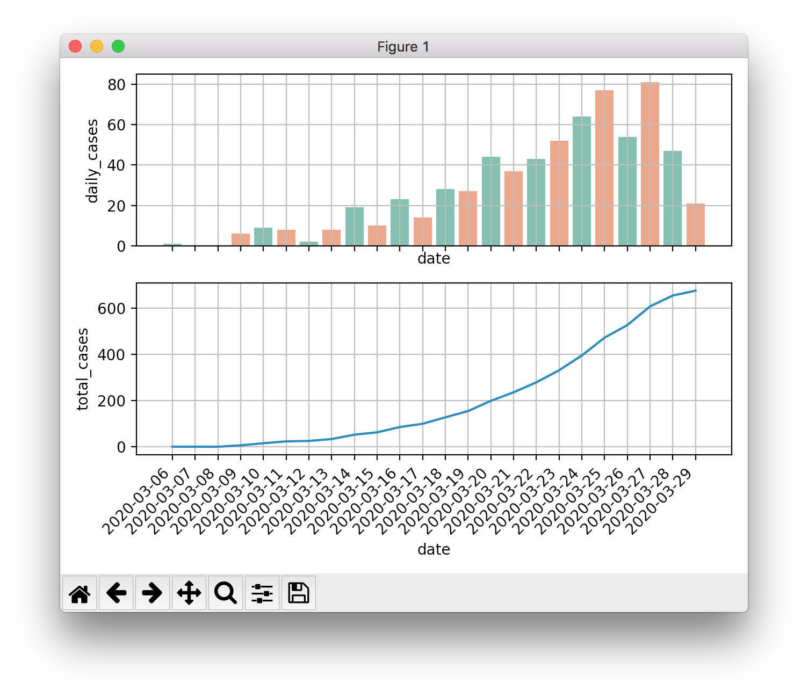
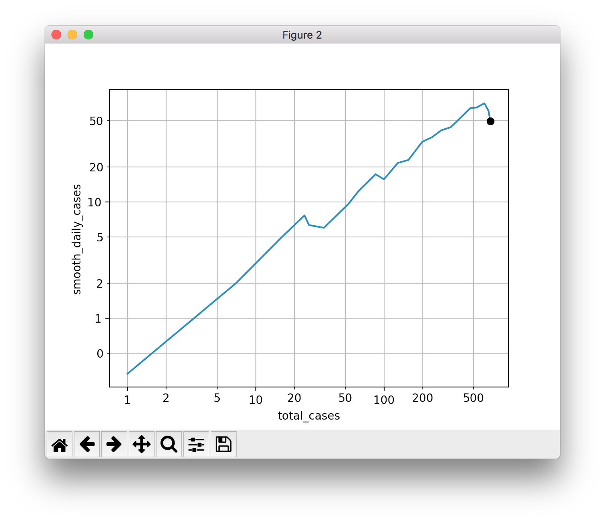
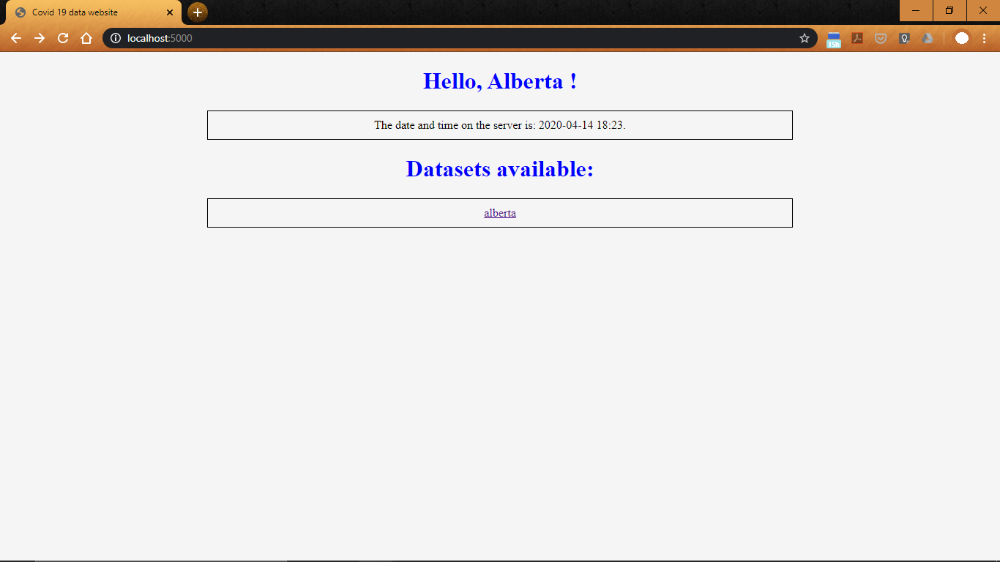
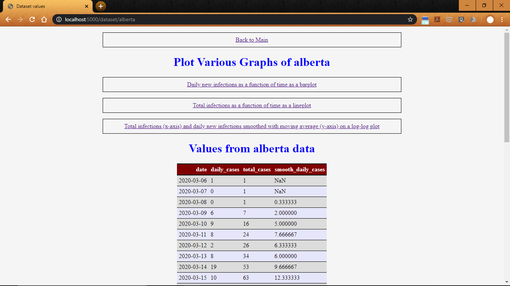
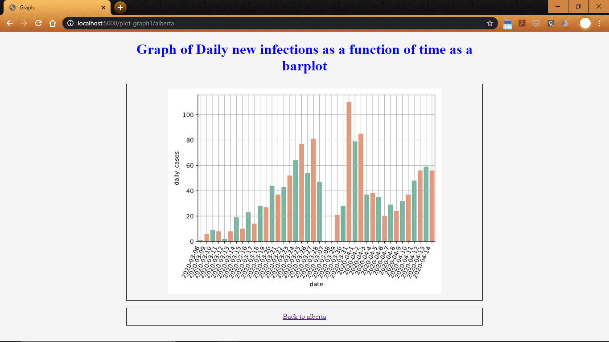
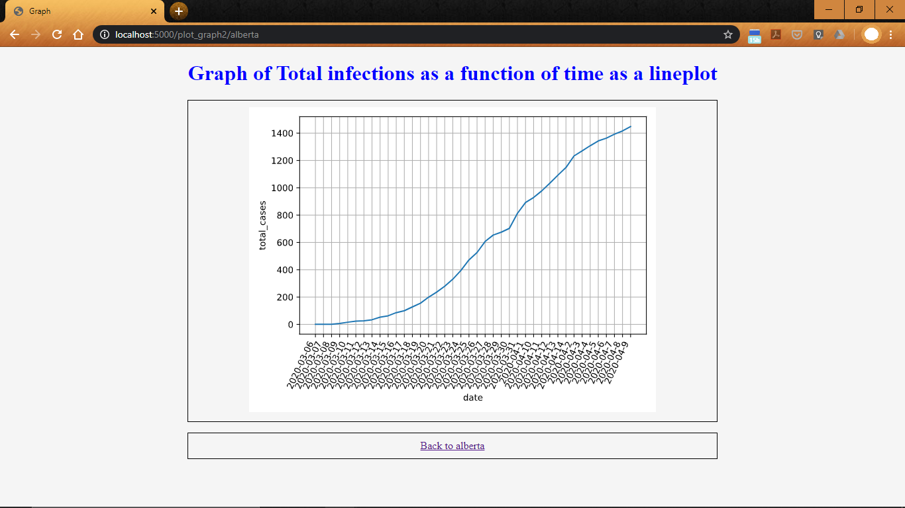
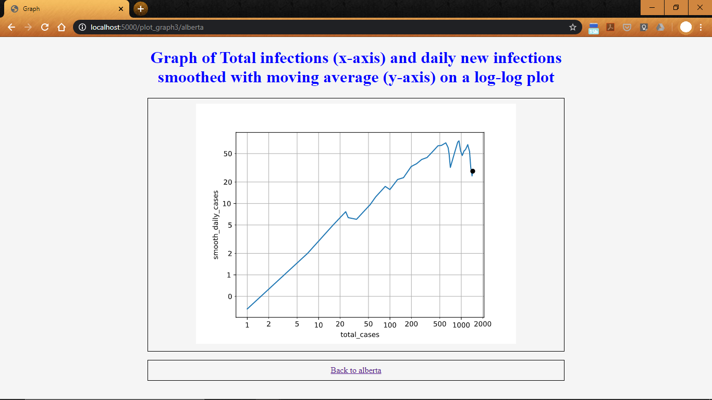

Author: Subramanian Narayanan
# Problem statement
Given the current situation, using COVID-19 data and visualization to understand the effects and spread of COVID-19 in Alberta

In the `data` sub-directory, you will find `measurements.db`, an Sqlite database with daily counts of new infections in Alberta. In the `tools` sub-directory, there are two Python programs that illustrate:
- how to read values from this database and produce plots, as well as
- inspecting, adding and removing measurements using a command-line interface application.

The first two plots, barchart and lineplot, are often seen in the media. The log-log plot is a format to better understand if we reached the hight of the wave, and was proposed in this video [Minutephysics - How To Tell If We're Beating COVID-19](https://www.youtube.com/watch?v=54XLXg4fYsc). Here are examples from produced by `tools/covid_plot.py`:

# How to run this program
Instructions to run the program : 
    
1. Install Python 3 and Vs code 

2. Download the entire project folder "a6-web-data-to-graph-nagusubra"

3. Open web_data_to_graph.py code with VS code

4. Press the play button (Run the program) on the right top corner (or you could also do step 5 instead)

5. in the terminal window of VS Code enter *python web_data_to_graph.py*

6. Steps 4/5 will start the flask server. Wait for several moments. Then go to step 7

7. Open your internet browser and type *http://localhost:5000/* to get this output
    

8. Now click on the alberta hyperlink or type *http://localhost:5000/dataset/alberta* to get this output 
    

9. You can scroll down to see all the data values 

10. Now click on the Daily new infections as a function of time as a barplot hyperlink or type *http://localhost:5000/plot_graph1/alberta* to get this output
    

11. Now click Back to alberta hyper link or click on the back button of the browser to go back 

12. Now click on the Total infections as a function of time as a lineplot hyperlink or type *http://localhost:5000/plot_graph2/alberta* to get this output
    

13. Now click Back to alberta hyper link or click on the back button of the browser to go back 

14. Now click on the Total infections (x-axis) and daily new infections smoothed with moving average (y-axis) on a log-log plot hyperlink or type *http://localhost:5000/plot_graph3/alberta* to get this output
    
    
15. More information regarding the server requests and the program will be given on the terminal output in the vs shell (just for additional information)